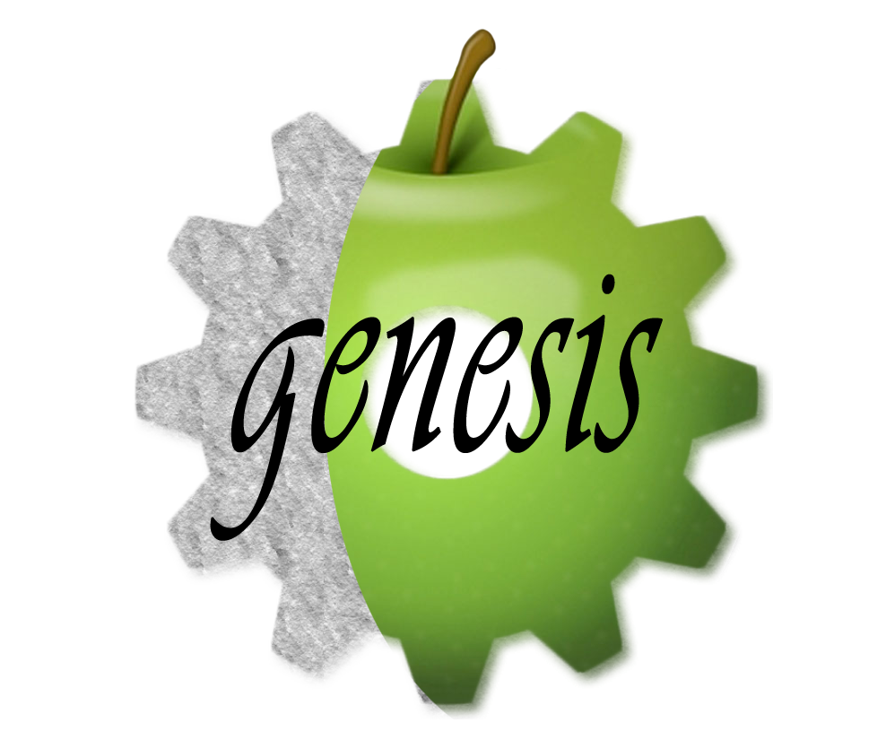

<section id="main_content">

<h1 class="inline">
    <a name="welcome-to-project-genesis" class="anchor" href="#welcome-to-project-genesis">
        
    </a>Welcome to GENESIS.
</h1>
    &nbsp;
    

    This piece of software is currently under development and will increase in size, quality and
    functionality!

    We are team JAMES, which is an acronym for our names. But what's more important is what we are developing: A
    piece of software that will enable biologists, or actually everyone, to design and simulate protein chain
    models. So now you can design your own micro-processes using proteins!

    The idea behind this is that proteins could somewhat behave like electrical circuits, but inside a cell!
    Certain combinations of proteins behave like AND gates, while other proteins behave like NOT gates. This
    enables the creation of logical circuits that also can be simulated.

    However, since this is an abstraction of the mechanics behind proteins, this model is not very representative
    for a real-life application. Though purely scientific, it's also fun to play around with!

<ul class="contentNav">
    <li>
        <a href="#step-by-step-guide-to-the-genesis-system">Step-by-step guide for simple circuits.</a>
    </li>
    <li>
        <a href="#specifying-the-inputs">More info about inputs.</a>
    </li>
    <li>
        <a href="#what-is-shown-in-the-output">What is the output.</a>
    </li>
    <li>
        <a href="#how-does-genesis-work">How does GENESIS work.</a>
    </li>
    <li>
        <a href="#more-advanced-genesis-functions">Guide for more advanced circuits.</a>
    </li>
    <li>
        <a href="#implemented-functionality">Core functionality.</a>
    </li>
    <li>
        <a href="#wanted-functionality-for-further-development">Wanted extra functionality.</a>
    </li>
    <li>
        <a href="#about-our-team-james">About team JAMES.</a>
    </li>
    <li>
        <a href="#what-libraries-were-used-for-genesis">Used libraries.</a>
    </li>
</ul>

    <h2 id="startup">Step-by-step guide to the GENESIS system:</h2>

    

        Below is a small guide to design your first small circuit. This is a basic guide, for more information
        you should refer to the <a href="#more-advanced-genesis-functions">advanced documentation</a> or contact <a href="#about-our-team-james">the
        team.</a> 
        The simple guide:
    

    <ol>
        <li>
            Make sure you have credentials! 
            Please contact the system administrator if you don't have or have forgotten your credentials.
        </li>
        <li>
            Log into the login page, check the remember me checkbox if necessary. 
            This is functionality that still has to be implemented, but feel free to check the box ;)
            <!-- TODO aanpassen bij implementatie -->
        </li>
        <li>
            Now you will be confronted with a setup modal. Pick the library you want to use. These are bound to
            your
            account or public. 
            These libraries contain the proteins that can be used and picked, so investigate into the libraries
            so you know which one to pick. 
            Click "Apply setup" to finish the setup and close the modal.
        </li>
        <li>
            Next you will have to name your circuit. No need to think of very complex names, these names only
            have
            to be unique within your account.
        </li>
        <li>
            Now you will see an input and an output gate. These will act as your input and output (duh..)! Drag
            and drop
            the corresponding elements on the right into the workspace to create a new gate instance. 
            While behind the hood these gates behave differently, the system is designed in such a way that the
            user can make his circuits easily.
        </li>
        <li>
            When you create a new instance, endpoints are added to the gate. Use these to connect your gates,
            but
            remember, gates have inputs and outputs, and they can only be dragged in one way! 
            After connecting you see the connection and on that connection will be an arrow indicating the
            direction of the connection.
        </li>
        <li>
            When two gates are linked up, you can click that connection to select the protein that should be
            used in
            that connection. Be careful not to chose the same protein multiple times. 
            After selecting you will see a label appear on the connection indicating what protein is used.
        </li>
        <li>
            When you are content with your circuit, you can click on "Simulation" and then "Run circuit" to
            start
            the simulation process. 
            !! This can take a while for larger circuits, but when the simulation is ready the results will show
            automatically. So be patient. !!
        </li>
        <li>
            But first you must input the input vectors, more will be explained in section <a
                href="#specifying-the-inputs"><strong>Inputs</strong></a>
        </li>
        <li>
            Finally you click "Apply" and the simulation will start. When done you will be presented with a
            graph
            and a button to download a .csv with the results. More info about the output in the <a
                href="#what-is-shown-in-the-output"><strong>Outputs</strong></a> section.
        </li>
    </ol>
    <a class="small" href="#welcome-to-project-genesis">Back to top!</a>

    <h2 id="inputs">Specifying the inputs:</h2>

    

        The inputs are specified in a vector format, meaning that all the values that belong together should be
        beneath each other.
        This is ordering is column based, and the first column should be the time at which the input should
        change. 
        For simpler use of this system, a binary input was chosen what will be parsed to weighed signals in the
        backend. 
        At the top of the vectors should be the identifiers, the first one being <q>t</q> for the time. Next
        should be all the protein names as described in the library. 
        Here is an example (though it's a cropped version better viewing of this page.):
    

    

    

        This is a simple input method so we could focus on getting the primary functionality working. In the
        section about <a href="#wanted">wanted functionality</a> you can read more about what our ideas where
        about what to implement when we would have had more time.
    

    <a class="small" href="#welcome-to-project-genesis">Back to top!</a>

    <h2 id="outputs">What is shown in the output:</h2>

    

        The output is specified by the circuit you designed, proteins you used, the library and the input signal. This
        is then sent to the back-end to be parsed into a full memory model, but more on that in the section about the
        <a href="#how-does-genesis-work">inner workings</a>. The output is then given back is the form of series data, for each input
        protein you get both the MRNA and protein levels as result. These levels are plotted in an interactive graph,
        meaning you can zoom horizontally for better insight in the change of levels. Also a .csv can be downloaded that
        will have the same form as the <a href="#specifying-the-inputs">input signal</a>. This can be used for further analysis and
        plotting outside of the GENESIS environment.
    

    <a class="small" href="#welcome-to-project-genesis">Back to top!</a>

    <h2 id="inner">How does GENESIS work:</h2>

    

        GENESIS is built upon the idea that proteins can be chained together to form simple circuits. This is a very
        abstracted idea, since external (other processes inside a cell) processes can and will influence the circuit.
        Since the notion is that a protein is released into the cell body fluid and not directed to a specific
        target/location, the best way to approach the levels and working of these proteins is through using differential
        equations. 
        On the back-end of the GENESIS system a full-memory model is used to extract the differential equation model
        using the levels of the MRNA and protein as variables, creating differentiable functions pointing to these
        specific levels, according to the circuit YOU designed. This system is solved in the specified number of steps
        over the specified time-span.
    

    

        Other important components are the web-framework on which GENESIS is built. This is the <a
            href="http://www.playframework.com/">Play! framework</a> This is a modular (<a
            href="http://en.wikipedia.org/wiki/Model%E2%80%93view%E2%80%93controller">MVC</a>) framework that can be
        built using Java and/or Scala. The front-end is built using HTML templates with Scala identifiers to inject
        other templates, data, raw HTML or a combination. To make the front-end appealing and interactive Javascript and
        CSS are used, like any other "normal" website.
    

    

        Within this framework objects and classes are used to represent the data, which in turn can be used to store in
        a database. We opted for an off-site database so everyone could use the same data and stay consistent. This
        database is a POSTGRESQL database, since is offers simple and efficient access to data as well as advanced
        functionality, like update rules and user login roles. 
        The most important information is stored inside the database, and only the most important. This is done to keep
        the database small and fast while being able to extract all useful information. This is why neither inputs or
        simulation results are stored. For longer simulations the results can consist of thousands of entries, or even
        millions. The same goes for the input, though on a smaller scale and on top of that, why would you want to use
        the same inputs every time you simulate?
    

    <a class="small" href="#welcome-to-project-genesis">Back to top!</a>

    <h2 id="advanced">More advanced GENESIS functions:</h2>

    

        Some functionality is not that straightforward and will be listed below for clarification:
    

    <ul>
        <li>
            You can specify a timespan over which you want to simulate. Standard is 5 seconds, but feel free to increase
            or decrease this amount as you feel fit.
        </li>
        <li>
            Also adjustable is the number of steps you want to simulate over, the more steps, the more detailed but
            also simulation will take longer. Remember that is the total number of simulated steps, not the number of
            steps per second.
        </li>
        <li>
            You can also save a circuit into the database, for use in further projects. To do this you click on
            "Circuit" and then "Save" to save your circuit. 
            If you want to save it as a different circuit you have to rerun the setup. This can be done by clicking
            "Simulation" and then "Setup". Now the setup modal will show again.
        </li>
        <li>
            If you want to load a circuit, click "Circuit" and then "Load". You will be presented with a list of
            your (or public) circuits you can load, and then edit or simulate.
        </li>
    </ul>
    <a class="small" href="#welcome-to-project-genesis">Back to top!</a>

    <h2 id="functionality">Implemented functionality:</h2>

    <a class="small" href="#welcome-to-project-genesis">Back to top!</a>

    <h2 id="wanted">Wanted functionality for further development:</h2>

    <a class="small" href="#welcome-to-project-genesis">Back to top!</a>

    <h2 id="aboutJames">About our team, JAMES:</h2>
    

        Developer: Michael The  
        Site: <a href="http://stackoverblog.wordpress.com">http://stackoverblog.wordpress.com</a>  
        Twitter: <a href="https://twitter.com/ReturnFalse">@ReturnFalse</a>  
        Location: The Netherlands, Rotterdam  
         
        Developer: Stijn van Schooten 
        Site: <a href="http://svanschooten.nl">http://svanschooten.nl</a>  
        Twitter: <a href="https://twitter.com/SSchooten">@SSchooten</a>  
        Location: The Netherlands, Delft 
         
        Developer: Edward 
         
        Developer: Jeroen 
         
        Developer: Anton 
    

    

        Thanks to:  
        Delft University of Technology  
         
        In special: 
        Dick de Ridder  
        Marcel Reinders  
        Alexey Gritsenko  
        Wouter Willems

    

    <a class="small" href="#welcome-to-project-genesis">Back to top!</a>

    <h2 id="libraries">What libraries were used for GENESIS:</h2>
    <ul>
        <li>
            <a href="http://jquery.com">jQuery</a>
        </li>
        <li>
            <a href="http://jqueryui.com">jQuery UI</a>
        </li>
        <li>
            <a href="http://twitter.github.io/bootstrap/">Twitter bootstrap</a>
        </li>
        <li>
            <a href="http://jsplumbtoolkit.com/">jsPlumb</a>
        </li>
        <li>
            <a href="http://code.shutterstock.com/rickshaw/">rickshaw</a>
        </li>
        <li>
            <a href="http://d3js.org/">d3.js</a>
        </li>
    </ul>

    <a class="small" href="#welcome-to-project-genesis">Back to top!</a>

</section>

